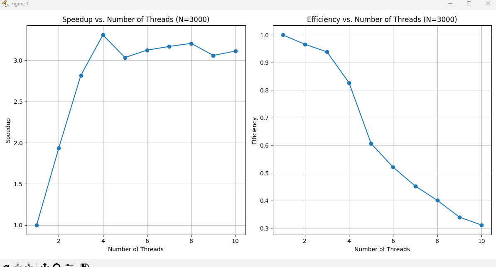
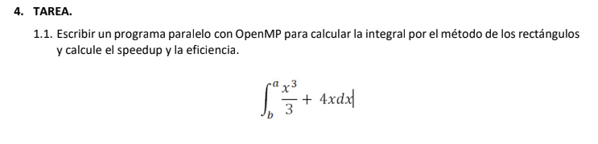
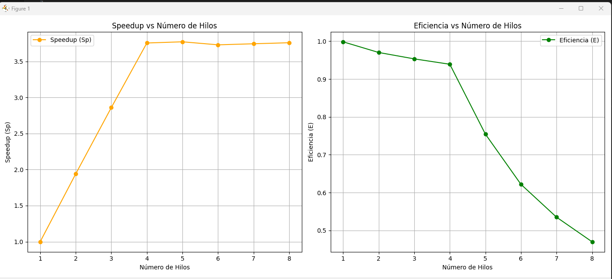

# Universidad Nacional de San Antonio Abad del Cusco
# Departamento Académico de Informática
# ALGORITMOS PARALELOS Y DISTRIBUIDOS

## Práctica No 4
## Profesor: HANS HARLEY CCACYAHUILLCA BEJAR
## Alumno: Efrain Vitorino Marin  Cod: 160337
## EJERCICIOS DE APLICACION

### 1. OBJETIVO.
*   Aplicar la programación paralela con OpenMP a la solución de problemas computacionalmente intensivos.
*   Evaluar el Speedup y la Eficiencia de un programa paralelo.
*   Utilizar adecuadamente las directivas de OpenMP para paralelizar un problema.

### 2. INTRODUCCION.
La computación paralela se aplica a algoritmos de cálculo intensivo para acelerar el cálculo u abordar problemas de mayor dimensión.

#### 2.1. Métricas para evaluar el desempeño de un sistema paralelo
Se evalúa con métricas como Speedup y Eficiencia, considerando el algoritmo y la arquitectura.

1.  ¿Qué algoritmo es más rápido?
2.  ¿Qué tan beneficioso es el paralelismo?
3.  ¿Cómo se comporta el algoritmo al variar características?

##### 2.1.1. Speedup.
Mide el beneficio de paralelizar, como el cociente del tiempo secuencial (T1) entre el tiempo paralelo (Tp) con p procesadores:

Sp = T1 / Tp

Speedup absoluto (T1 con el mejor algoritmo secuencial) y relativo (T1 ejecutando el algoritmo paralelo con un sólo procesador).

##### 2.1.2. Eficiencia
Mide la fracción de tiempo eficaz de los procesadores:

E = Sp / p

### 3. DESARROLLO DE LA PRÁCTICA

#### 3.1. MULTIPLICACION DE MATRICES.
Paralelismo de datos donde cada hilo trabaja con datos distintos, pero con el mismo algoritmo.

## Evaluacion del desempeno del algoritmo paralelo para multiplicar dos matrices
### Tabla 1. Parametros iniciales
Arquitectura del equipo: Intel Xeon
Nro. de procesadores: 12
Tamano del problema: N = 500
[Enlace al código fuente](ejersicio1.cpp)
### Tabla 2. Resultados experimentales
| Nro. Hilos | Tiempo Paralelo (seg) | Speedup (Sp) | Eficiencia (E) |
|------------|-----------------------|--------------|----------------|
|          1 |                 0.457 |        0.954 |          0.954 |
|          2 |                 0.263 |        1.658 |          0.829 |
|          4 |                 0.132 |        3.303 |          0.826 |
|          6 |                 0.130 |        3.354 |          0.559 |
|          8 |                 0.133 |        3.278 |          0.410 |
|         10 |                 0.142 |        3.070 |          0.307 |
|         12 |                 0.140 |        3.114 |          0.260 |
# Resultados del Algoritmo de Floyd-Warshall Paralelo

Este programa implementa el algoritmo de Floyd-Warshall para calcular las distancias más cortas entre todos los pares de nodos en un grafo.

### Enlace al código fuente
[Código fuente](ejercicio2.cpp)

### Tabla 2. Resultados experimentales
| Nro. Hilos | Tiempo Paralelo (seg) | Speedup (Sp) | Eficiencia (E) |
|------------|-----------------------|--------------|----------------|
| 1 | 81.181 | 1.04653 | 1.04653 |
| 2 | 43.3 | 1.96208 | 0.981039 |
| 3 | 30.077 | 2.82468 | 0.941561 |
| 4 | 22.986 | 3.69608 | 0.924019 |
| 5 | 22.635 | 3.75339 | 0.750678 |
| 6 | 23.556 | 3.60664 | 0.601107 |
| 7 | 23.024 | 3.68998 | 0.527139 |
| 8 | 22.741 | 3.7359 | 0.466987 |
| 9 | 22.823 | 3.72247 | 0.413608 |
| 10 | 22.807 | 3.72508 | 0.372508 |

# ALGORITMO DE FLOY - WARSHAL

Este programa implementa el algoritmo de Floyd-Warshall para calcular las distancias más cortas entre todos los pares de nodos en un grafo.

### Enlace al código fuente
[Código fuente](ejercicio3.cpp)

### Tabla 2. Resultados experimentales
PS D:\Algoritmos-Paralelos\laboratorio4> .\ejersicio3
Ingrese el valor de n: 500

| Nro. Hilos | Tiempo Paralelo (seg) | Speedup (Sp)   | Eficiencia (E) |
|------------|-----------------------|----------------|----------------|
|          1 |               0.46900 |        0.85714 |        0.85714 |
|          2 |               0.25400 |        1.58268 |        0.79134 |
|          3 |               0.17100 |        2.35088 |        0.78363 |
|          4 |               0.14200 |        2.83099 |        0.70775 |
|          5 |               0.13800 |        2.91304 |        0.58261 |
|          6 |               0.13900 |        2.89208 |        0.48201 |
|          7 |               0.13200 |        3.04545 |        0.43506 |
|          8 |               0.15700 |        2.56051 |        0.32006 |
|          9 |               0.14400 |        2.79167 |        0.31019 |
|         10 |               0.14700 |        2.73470 |        0.27347 |

# Tarea

## resultado 
Resultado de la integral (secuencial): 1033.33
Tiempo secuencial: 34.129 segundos

| Nro. Hilos | Tiempo Paralelo (seg) | Speedup (Sp) | Eficiencia (E) |
|------------|-----------------------|--------------|----------------|
|          1 |               34.185 |      0.99836 |        0.99836 |
|          2 |               17.589 |       1.9404 |        0.97018 |
|          3 |               11.934 |       2.8598 |        0.95327 |
|          4 |                9.086 |       3.7562 |        0.93906 |
|          5 |                9.046 |       3.7728 |        0.75457 |
|          6 |                9.148 |       3.7308 |        0.62179 |
|          7 |                9.112 |       3.7455 |        0.53507 |
|          8 |                9.077 |       3.7599 |        0.46999 |

PS D:\Algoritmos-Paralelos\laboratorio4>

# grafico 
